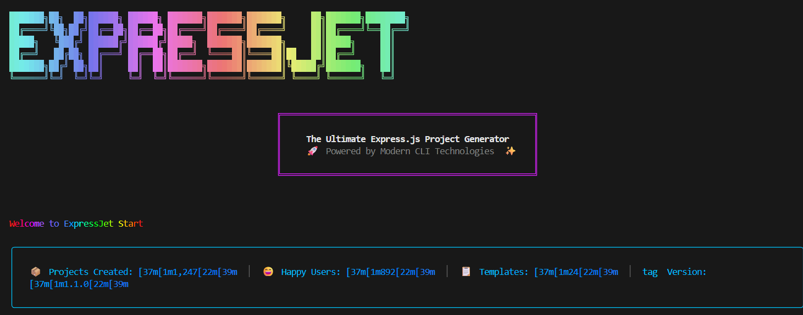

# express-jetstart CLI

A fast CLI to scaffold production-ready Express apps in seconds.

## Quick Start

```bash
npx express-jetstart@latest
```


If this command shows an older cached version on your machine, use `@latest`.

## Preview


(./assets/express-jetstart-preview.png)

Place the screenshot you shared at:

`assets/express-jetstart-preview.png`

## Features

- Instant Express project scaffolding
- JavaScript or TypeScript setup
- ESM or CommonJS options
- Clean folder structure with starter files
- Ready-to-run project output

## Generated Structure

```text
your-project/
├── src/
│   ├── controllers/
│   ├── routes/
│   ├── models/
│   └── middleware/
├── public/
├── .env
├── .gitignore
├── server.js (or server.ts)
├── package.json
└── README.md
```

## Development

```bash
npm install
npm run build
npm run dev
```

## Contributing

Issues and PRs are welcome.

- Report issues: https://github.com/AvusalaChetan/express-jetstart-CLI/issues
- Repository: https://github.com/AvusalaChetan/express-jetstart-CLI

## License

MIT
